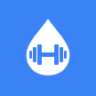
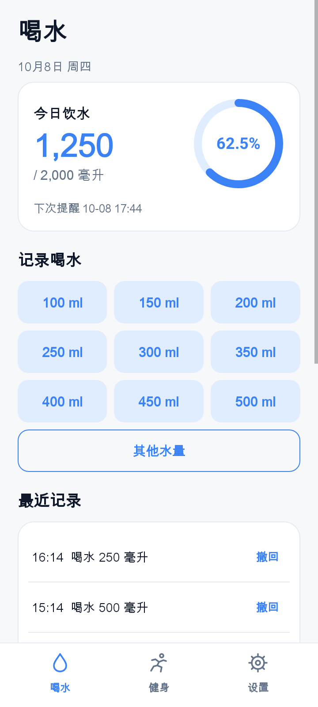
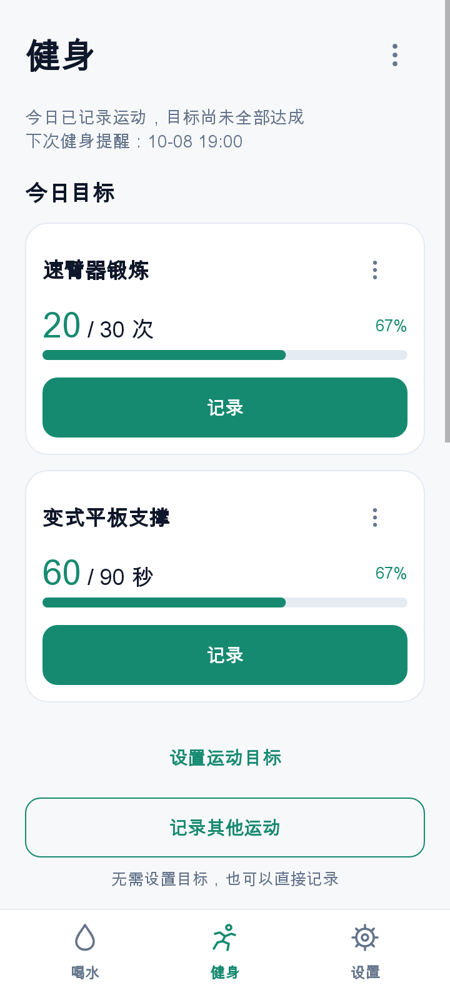
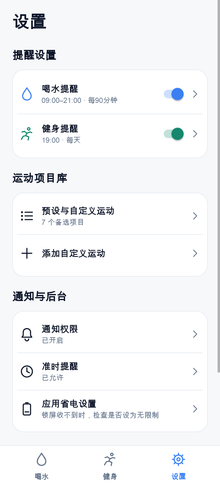
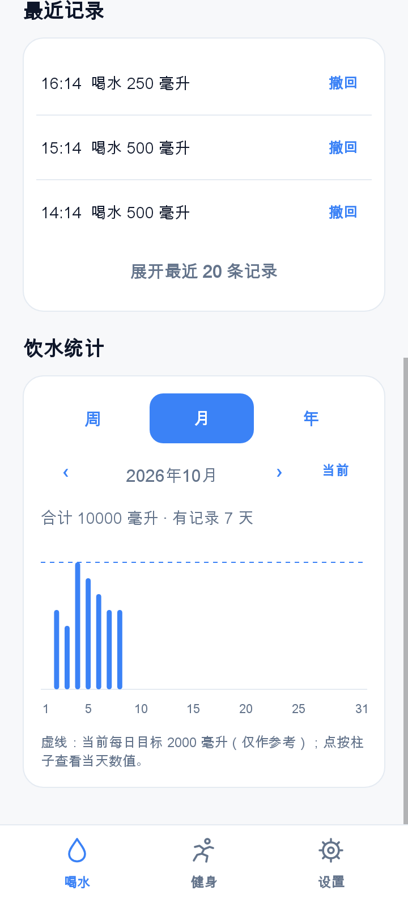
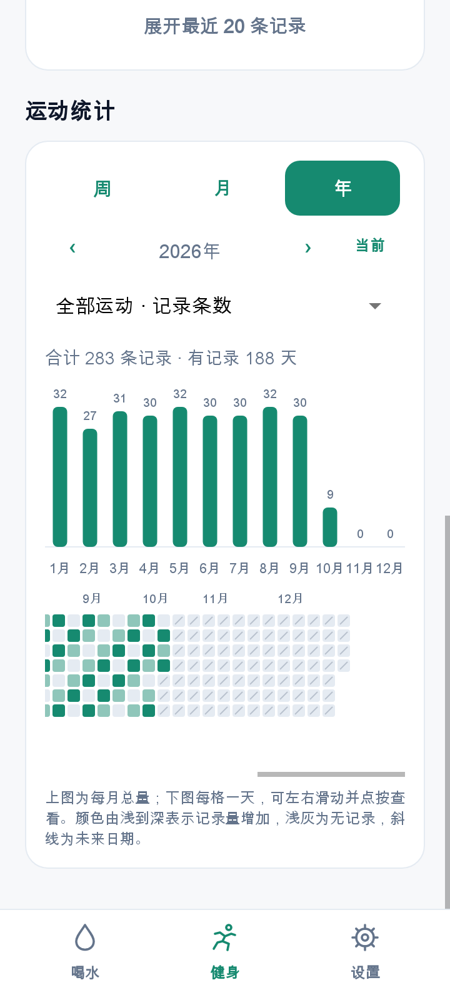

<p align="center">
  
</p>

<h1 align="center">Sip & Fit · 喝水与健身</h1>

<p align="center">记下每一杯水、每一次运动，让日常习惯看得见。</p>

<p align="center">
  <a href="https://github.com/seven11sys/sip-and-fit/releases/latest">下载最新版</a> ·
  <a href="#界面一览">查看界面</a> ·
  <a href="#开始使用">开始使用</a>
</p>

Sip & Fit 是一款面向个人日常使用的 Android 应用，把喝水记录、运动目标和定时提醒放在一起。喝过一杯水、做完一组运动，随手记下；忙起来容易忘记时，让提醒帮你记得；想回顾自己的节奏时，再从周、月、年的统计中查看变化。

应用不需要注册账号，记录和设置保存在手机本地。界面分为 **喝水、健身、设置** 三个页面，让每天常用的记录操作保持直接，把提醒规则、运动项目库和通知检查集中放在设置里。

设置页底部的“关于应用”会显示当前安装版本，方便确认更新是否生效。

## 界面一览

<table>
  <tr>
    <th>喝水：记录与今日进度</th>
    <th>健身：按自己的目标记录</th>
    <th>设置：提醒与运动项目库</th>
  </tr>
  <tr>
    <td></td>
    <td></td>
    <td></td>
  </tr>
</table>

> 图片由 v0.7.1 的实际应用界面渲染，使用独立示例数据，并非手机实拍。首次安装时没有运动目标或历史记录；截图中的项目、目标和完成量仅用于展示。

## 轻松记录，随时修正

### 喝水：一杯一记，进度随记录更新

喝水页把今日总量、目标和进度环放在一起，打开就能看到今天喝了多少。常用水量从 **100 到 500 毫升，每隔 50 毫升一档**，点击即可记录；遇到不同容量的杯子，也可以输入自定义水量。

最近记录默认显示三条，需要时可展开查看最近二十条。误点后可以逐条撤回，饮水总量、进度、统计图和提醒安排会随之更新。

### 健身：目标可以不同，记录方式也可以不同

运动并不都适合用时长衡量。Sip & Fit 支持按 **时长、距离、次数** 设置每日目标：速臂器锻炼可以记次数，平板支撑可以记秒数，跑步和骑行也可以记距离。同类单位会自动换算，例如一分钟的记录可以计入以秒为单位的目标。

两种记录方式适合不同的安排：

- **已有目标的运动**：在对应目标卡片中点击“记录”，只需输入这次完成的量。当天多次记录会累计，所有已设目标达标后，应用自动判断今日健身已完成。
- **临时做的运动**：选择“记录其他运动”，填写项目、计量方式和完成量即可，不必先创建目标。

运动项目库预设了速臂器锻炼、变式平板支撑、俯卧撑、深蹲、跑步、骑行和拉伸，也可以添加自己的项目。**添加项目与设置目标是两个独立操作**：加入项目库只是让它成为备选项，是否设为每日目标由你决定。

运动记录同样可以撤回，目标进度会重新计算。需要休息一天时，可以选择“今天跳过健身”，也可以撤回跳过；移除目标则会保留项目库和历史记录。

## 从一天的记录，看见长期的节奏

喝水和健身都支持 **周、月、年** 三种统计范围，可以向前查看历史周期，也能一键回到当前周期。

| 范围 | 展示内容 |
| --- | --- |
| 周 | 连续七天的每日记录量，便于查看近期变化。 |
| 月 | 自然月内的每日柱状图、累计总量和有记录的天数。 |
| 年 | 十二个月的累计总量，以及每一天对应的记录热力图。 |

<table>
  <tr>
    <th>饮水月统计</th>
    <th>运动年统计与每日热力图</th>
  </tr>
  <tr>
    <td></td>
    <td></td>
  </tr>
</table>

健身统计先选择时间范围，再按需要筛选项目。默认的“全部运动”展示 **记录条数和有运动记录的天数**；选择具体项目后，再查看对应的时长、距离或次数，避免把不同计量方式相加。切换项目时，已选的统计周期会保留。

热力图每一格代表一天，可以左右滑动、点按查看当天数值。**颜色越深表示该年份内记录量越多**，浅灰代表没有记录，斜线标记尚未到来的日期。热力图反映实际记录量，不表示历史目标达成率；饮水图上的虚线使用当前每日目标，仅供对照。

## 让提醒贴近日常安排

喝水和健身的提醒分别设置、分别自动保存，调整其中一项不会重置另一项的倒计时。有效设置会自动生效；输入无效时，应用提示原因并保留上次有效设置。

| 提醒 | 可以怎样安排 |
| --- | --- |
| 喝水 | 设置每日开始、结束时间和提醒间隔，可加入午休暂停；记录喝水后重新计时。达到目标后，可停止当天提醒，次日恢复。 |
| 健身 | 设置固定时间与每周重复日期，每天最多一次正常提醒；所有目标完成或当天跳过后，不再提醒。 |

点击通知可以进入对应的记录页面，通知也提供记录、稍后提醒或跳过等快捷操作。手机重启、时间或时区改变、应用更新后，会重新恢复提醒安排，不补发积压的旧提醒。

提醒默认关闭，需要在设置中主动开启。当前喝水提醒时段暂不支持跨午夜。

## 开始使用

1. 前往 [GitHub Releases](https://github.com/seven11sys/sip-and-fit/releases/latest)，在 **Assets** 中下载 APK，直接在 Android 手机上安装，无需解压。最低支持 **Android 8.0**。
2. 在“设置”中开启需要的提醒，允许系统通知；需要更准时的提醒时，再检查“准时提醒”权限。
3. 按自己的安排设置饮水目标、提醒时段，以及需要的运动目标。运动目标可以暂时留空，先用自由记录开始。
4. 使用“测试通知”里的立即测试和一分钟后测试，分别确认前台显示及锁屏后的通知接收情况。

同签名版本可直接覆盖安装并保留记录。记录目前只保存在本机，尚未提供云同步和数据导入导出；卸载应用会删除本地数据。

### 收不到提醒时

先比较两种测试的结果，再选择对应的排查方向：

- **立即测试也没有显示**：检查系统通知权限，以及通知类别的声音、悬浮通知和锁屏显示设置。
- **立即测试正常，锁屏后没有收到**：检查应用省电、后台运行及自启动限制。小米／红米设备可先将应用省电设置为“无限制”；这一设置已在小米 17、HyperOS 3.0.319 的用户测试中验证有效。
- **提醒仍然延迟**：查看测试入口中的最近定时触发和通知提交时间，区分“定时没有触发”和“通知已提交但没有显示”。未允许精确定时权限时，提醒本身也可能延迟。

不同手机的设置名称和后台策略有所区别，允许通知不等于允许应用持续在后台运行。手动强行停止应用后，需要再次打开应用恢复提醒。

## 开发与构建

项目使用 **Kotlin 和 Android 原生 View**，不依赖后端服务。开发环境为 Android Studio、JDK 17、Android SDK 35 和 Gradle 8.11.1。

```sh
./gradlew testDebugUnitTest assembleDebug lintDebug
```

APK 输出在 `app/build/outputs/apk/debug/app-debug.apk`。自动测试覆盖提醒时间规则、记录撤回、目标累计、单位换算、数据迁移、页面操作、统计日期边界和项目筛选；锁屏通知及厂商后台策略仍需结合真机验证。

主要代码入口：

| 文件 | 负责的内容 |
| --- | --- |
| [MainActivity.kt](app/src/main/java/com/sev7n/drinkexercise/MainActivity.kt) | 三个页面、记录操作与设置入口。 |
| [ReminderStore.kt](app/src/main/java/com/sev7n/drinkexercise/ReminderStore.kt) | 本地设置、项目、目标及历史记录。 |
| [ReminderRules.kt](app/src/main/java/com/sev7n/drinkexercise/ReminderRules.kt) · [ReminderScheduler.kt](app/src/main/java/com/sev7n/drinkexercise/ReminderScheduler.kt) | 提醒规则计算及 Android 系统定时、通知。 |
| [DailyStats.kt](app/src/main/java/com/sev7n/drinkexercise/DailyStats.kt) · [StatsPanel.kt](app/src/main/java/com/sev7n/drinkexercise/StatsPanel.kt) | 统计汇总、范围切换、图表与每日热力图。 |

### 发布安装包

普通代码推送会运行测试、构建和 lint，并在 [GitHub Actions](https://github.com/seven11sys/sip-and-fit/actions) 保留七天的开发构建产物。

正式发布一个版本时，先更新 `app/build.gradle.kts` 中的 `versionCode` 和 `versionName`，再推送与版本号一致的 `v版本号` 标签。标签构建通过检查后，工作流自动创建 **GitHub Release** 并上传 APK。Release 安装包不受 Actions 产物的七天保留期限制。

当前发布的 APK 使用缓存的 debug 签名密钥，以便测试版之间覆盖安装。如果密钥缓存被清理，需先确认签名和升级方式，避免因卸载导致本地记录丢失。

## 后续方向

Sip & Fit 仍在持续完善。接下来考虑增加数据导入导出、桌面小组件，并探索鸿蒙原生版本；这些功能目前尚未实现。
